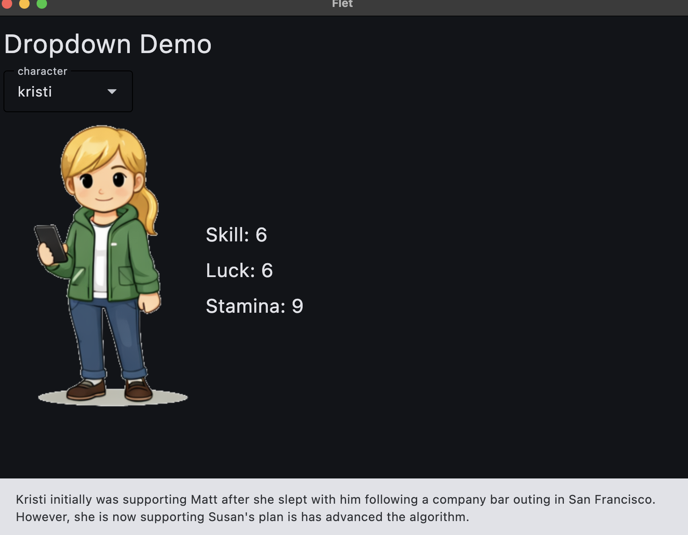
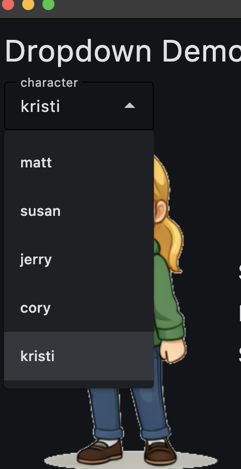

# Flet Dropdown & Snackbar Tutorial

A tutorial demonstrating how to use dropdowns and snackbars in Flet applications.



## Video Tutorials

1. **38 Flet Dropdown Menu Tutorial (Python 3.13 + uv) | Beginner-Friendly Walkthrough - PYTH 9.02** - [https://youtu.be/K_hl5ohe02w](https://youtu.be/K_hl5ohe02w)

2. **39 Python OOP Fundamentals with Flet | Classes, Lists, Dictionaries, and Dropdown Menus PYTH 9.03** - [https://youtu.be/CPowBrszKyg](https://youtu.be/CPowBrszKyg)

3. **40 Hands-On Flet Tutorial: use_state for Interactive UI with Dropdowns and Objects PYTH 9.04** - [https://youtu.be/e9ZgCQZ2Kys](https://youtu.be/e9ZgCQZ2Kys)

4. **41 Understanding use_state in Flet: Declarative State, Rerenders, and UI Updates PYTH 9.05** - [https://youtu.be/OvPLBTdbxw8](https://youtu.be/OvPLBTdbxw8)

5. **42 Hands-On Flet Tutorial: Adding a Snackbar with State and Event Handlers PYTH 9.06** - [https://youtu.be/KkSuR2LUYpM](https://youtu.be/KkSuR2LUYpM)

6. **43 Flet Snackbar Explained: State, Keys, and Non-Blocking Notifications - Lecture 9.07** - [https://youtu.be/5jgcD3A9ltQ](https://youtu.be/5jgcD3A9ltQ)

## Overview

This tutorial demonstrates:

- Using `ft.Dropdown` for character selection
- Managing state with `ft.use_state`
- Displaying dynamic content based on selection
- Using `ft.SnackBar` to show contextual messages
- Working with dataclasses in Flet applications

## Installation

This project uses `uv` for dependency management. To install dependencies:

```bash
uv sync
```

This will install all dependencies specified in `pyproject.toml`, including Flet.

To run the application:

```bash
uv run flet main.py
```

## Action Shot


